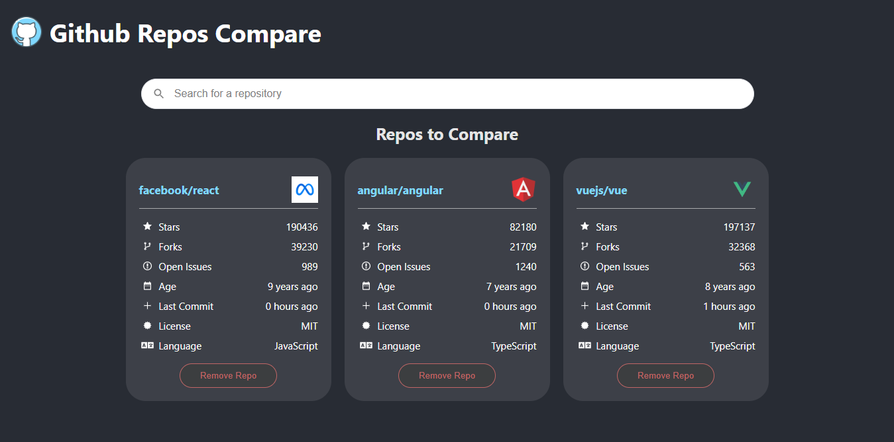

# github-repos-compare

**Author**: Noor AL-Omari

**Version**: 1.0.0 

## Overview
<!-- Provide a high level overview of what this application is and why you are building it, beyond the fact that it's an assignment for this class. (i.e. What's your problem domain?) -->
Website allow the user to search for Github's repos, see the information, add/remove repos to compare between them.

## Getting Started
<!-- What are the steps that a user must take in order to build this app on their own machine and get it running? -->
1. Clone the project to your local device using one of these command :
    - SSH : `git clone git@github.com:nooromari/github-repos-compare.git`.
    - HTTPS : `git clone https://github.com/nooromari/github-repos-compare.git`.
2. Install needed packages:  
    - In the project root run `npm install`.
3. To run the project :
    - run `npm start`.

## Architecture
<!-- Provide a detailed description of the application design. What technologies (languages, libraries, etc) you're using, and any other relevant design information. -->
### Technologies used:
    - React
    - CSS
    - Libraries used :
        - axios
        - moment
        - react-search-autocomplete
        - react-icons
    - Github's REST API
    - Heroku
    - PWA

<!-- ## Change Log -->
<!-- Use this area to document the iterative changes made to your application as each feature is successfully implemented. Use time stamps. Here's an examples:

01-01-2001 4:59pm - Application now has a fully-functional express server, with a GET route for the location resource.

## Credits and Collaborations
<!-- Give credit (and a link) to other people or resources that helped you build this application. -->

## [Live URL](https://fast-basin-48974.herokuapp.com/)

